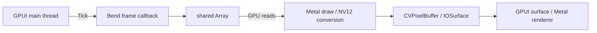

# Bend → GPUI 描画バインディング

再利用するAPI・Rust crate・ビルダーは[packages/bend-gpui](../../packages/bend-gpui/README.md)へ分離した。このディレクトリにはGrid・画素デモと検証oracle・計測記録を置く。`api.bend`・`native.c`・`abi.h`・`convert.metal`はパッケージ内の実装へのsymlinkで、コピーした実装を別々に保守しない。

最小のアプリは[minimal.bend](minimal.bend)。`just gpui-build examples/gpui/minimal.bend`で構築できる。既存の`just gpui grid`・`just gpui shader`も同じライブラリを使う。

macOS の GPUI 0.2.2 と、固定版 Bend 2.0.34 を同じプロセスにリンクする最小バインディング。
Bend の共有配列を Metal で直接読み、GPUI の `surface` に接続する。
画像・矩形の内容を CPU の配列に読み出す処理は通常の描画経路にない。

```sh
# CPUでGridを計算、Metalで矩形を描画、GPUIで表示
just gpui grid

# Bend Metalで画素を生成して表示（CPU版との比較は --gpu off）
just gpui shader --gpu on

# 既存Grid JSONをウィンドウのサイズで再配置
just gpui grid --page examples/grid/fixtures/dashboard.json

just check-gpui
just check-gpui-window
just bench-gpui
```

Rust/Cargo、Bun、Python 3、clang、macOS 15以降のMetal環境が必要。
依存はパッケージの `Cargo.lock` と `gpui = 0.2.2` で固定し、Rustのビルド成果物も `build/gpui/` に置く。
`MACOSX_DEPLOYMENT_TARGET` はCとRustの両方に渡す。既定は固定版Bendが使うMetal APIに合わせた15.0。
`BEND_REPO` は既存スクリプトと同じように利用できる。

ウィンドウはサイズ変更に合わせてBendのフレーム関数を呼び直す。Pause / Resumeで更新を止められる。
ここでのPauseは画像を固定する動作なので、停止中のサイズ変更では同じ画像を拡大・縮小する。
`--frames N` で自動終了し、各フレームのJSONを出す。既定の連続表示ではログを出さない。

## 契約と所有権

[`api.bend`](api.bend) がBend側、[`abi.h`](abi.h) がC/Rust境界の契約。

```bend
type Tick is Data:
  Tick{width: U32, height: U32, frame: U32}

type Frame is Type:
  Pixels{width: U32, height: U32, buffer: Array<U32>}
  Rects{count: U32, errors: U32, buffer: Array<F32>}

def run(width: U32, height: U32, max_frames: U32, draw: Tick -> Frame) -> IO(Unit):
  import "./native.c"
```

`Pixels` は row-major の `0xAABBGGRR`、`Rects` はnode id順の `x/y/width/height`。
配列の容量は必要なセル数以上の2の累乗。Rectsは1〜2,048個、先頭は背景となるroot。
GPUのvertex shaderがid 1以降の矩形を入力順に描く。デモはidから色を決め、各辺に2pxの余白を入れる。
実際のGrid計算は既存の [`gpu-flat.bend`](../grid/gpu-flat.bend) を再利用する。

width / heightは2〜2,048の偶数。CLIの奇数指定は一つ小さい偶数に丸める。
ウィンドウの論理pxを画像のpxとして使い、Retinaのscale factorに合わせた高解像度生成はまだ行わない。

描画の流れは次のとおり。



1. BendのIO effectがmain threadでGPUIのイベントループを開始する。
2. 再利用できるBendのclosureをretainし、`corpus_eval`でTickを渡す。callback内の `Draw.frame!` がGPUへの境界になる。
3. Metal版はBendの既存 `gpu_buf` とArrayのoffsetを使う。CPU版も配列のあるheap領域だけを `newBufferWithBytesNoCopy` で参照する。
4. 矩形はCPUで頂点に展開せず、共有座標をvertex shaderが直接読む。画像はcompute shaderが共有画素を読む。
5. 矩形描画とNV12変換を一つのcommand bufferで実行し、完了後にBendのArrayをdropする。
6. Rustは受け取った `CVPixelBuffer` をretainしてGPUIに渡す。各フレームの出力は別のIOSurfaceで、表示中の画像を上書きしない。

GPUI 0.2.2 の [`surface`](https://docs.rs/gpui/0.2.2/gpui/fn.surface.html) はmacOSの `CVPixelBuffer` を受け取る。
同版の [Metal renderer](https://github.com/zed-industries/zed/blob/69e2130295c2649963eb639fc70b4f2ee8ea1624/crates/gpui/src/platform/mac/metal_renderer.rs#L1085)
はNV12 full-rangeを前提に、CoreVideoのtexture cacheからY/UVのGPU textureを作る。
このためアダプタ側でNV12へ変換する。GPUで形式を変換する費用はある。

## 検証と計測範囲

`just check-gpui` はC/RustのABI、サイズ・形式の拒否、CPU/GPUの各3フレームを32×16と384×256で確認し、パッケージ単体をコピーした別プロジェクトのビルド・描画も検証する。
独立したCのGrid実装または画素の算術式から、NV12の全Y/UVセルを検証する。丸め差の許容は1/255。
`--verify` だけが変換後の画像をCPUで読む。Bendの出力配列は検証時にもCPUで読まない。

`just check-gpui-window` は実際のウィンドウを開き、Grid CPU / shader Metal の3フレームを全画素検証して自動終了する。
Apple M5で両方成功。目視・クリック操作はComputer Useのnative pipe起動失敗で未確認。

`just bench-gpui` は先に両バイナリをビルドし、960×540固定で4条件を直列に実行する。
同一プロセスの2 warmups + 5 samples。ヘッドレスで表示先と同じCVPixelBufferを作り、検査用readbackを無効にする。
[`results-macos-m5.json`](results-macos-m5.json) に環境、実際のBendコミット、source/generated hash、生のsampleを保存する。

| フィールド | 範囲 |
|---|---|
| `bend_ns` | callbackのBend計算。GPUの場合は同期完了待ちを含む |
| `bend_gpu_commands`, `bend_gpu_ns` | 実際のBend Metal dispatch数・GPU実行時間。fallbackを拒否する |
| `handoff_ns` | output契約確認、画像確保、Metalのencode・commit・完了待ち |
| `convert_gpu_ns` | GPUでの矩形描画とNV12変換。画素モードではNV12変換のみ |
| `convert_wait_ns` | adapter command bufferのCPU完了待ち。GPU時間と重なる |
| `drop_ns` | 変換完了後のBend出力の回収 |
| `frame_ready_ns` | `bend + handoff + drop`。GPUIに渡せる画像ができるまで |
| `cpu_payload_read_bytes` | 通常経路にBend配列のCPU readがないことを表す契約値。ハードウェアのメモリ計数ではない |
| `verified_pixels` | 診断用に全画素を検証した場合だけ画像サイズになる |

この計測にはGPUIのscene描画・present、画面に表示されるまでの待ち、入力応答は入らない。
`frame_ready_ns` の逆数を表示FPSと呼ばない。Rust部分はdev profile、Bendの生成Cは `-O3`。

Apple M5 / CPU 10 cores / GPU 10 cores、2026-10-02。median、単位ms。

| 入力 / Bendの実行先 | Bend計算 | 描画への引き渡し | 画像準備の合計 |
|---|---:|---:|---:|
| Grid / CPU 10 | 0.061 | 0.587 | **0.647** |
| Grid / Metal | 12.377 | 0.456 | 12.815 |
| 単純な画素生成 / CPU 10 | 0.612 | 0.526 | **1.139** |
| 単純な画素生成 / Metal | 12.004 | 0.403 | 12.409 |

合計は同じsampleの `frame_ready_ns` のmedianで、列ごとのmedianを足した値とは異なる場合がある。
このデモでは計算をCPU、描画をMetalにする方が速い。
Gridは一ページの逐次処理、画素生成は256 jobsの軽い整数演算で、GPUに十分な重い独立計算を渡していない。
GPUからCPUへの取り出しを省く接続はできたが、この計算条件でBend GPUが速くなるとは示していない。
GPU適性は仕事量と並列度を変えた追加実験で判断する。

## 現在の制約

最小のウィンドウ・描画callback・画像surfaceのバインディングで、GPUI全体のwidget APIは公開していない。
Bendのcallbackは純粋関数で、Tick以外のマウス・キーイベントやIOはまだ渡さない。
GPUIがmain threadのイベントループを占有し、その間は元のBend IOループを進めない。
macOS版GPUIの `quit` はプロセスを終了するため、GUIを閉じた後のBend IO継続はこの版の契約に含めない。

NV12は不透明な8-bit YUV 4:2:0。alphaは使わず、色境界にchroma subsamplingがある。
RGBA/HDR/透明なGUI部品を厳密に再現するには、別のtexture入力経路が必要。

Bend GPU計算とadapter描画はそれぞれ同期完了を待つ。
CPU readbackを省けたことと、CPU/GPUを非同期に重ねることは別で、後者はまだ実装していない。
新しいIOSurfaceを毎フレーム確保するため、poolや複数bufferの再利用を導入する余地もある。
upstreamのBend・GPUIには変更を加えていない。
